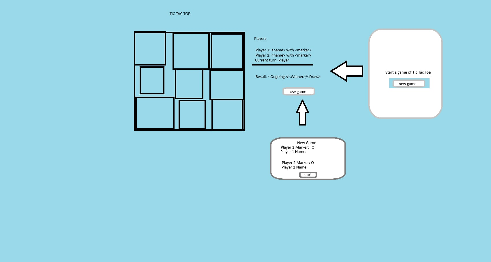

# Development Plan

The ideas here are not meant to be a strict 1:1 version of "from plan to code". It's just a general sense of how I figure things the obvious stuff out.

## First Phase

The goal of the first phase is to build the entire project within the console. All of the functionalities of the game must be proven working before working with the DOM, which will be started at the next phase.

### Objects needed

1. Gameboard

    **General description**: This function should control the TicTacToe's board states, add markers, and provide public API to allow players place their choice of cell.

    - The board data structure must be an array. One dimensional should be enough.
    - Each square (or space in array) is a Cell object
    - Must have a function that enters the player's cell choice with their marker
    - For now, we can return the function for board's state, fn for printing the board, and fn for marker placer

1. Cell

    **General description**: This function should act as the individual squares of the TTT board, which will look like 9 `Cell`s in an array.

    - Each cell will contain null
    - This cell will return the cell's value and marker adder

1. GameController

    **General description**: This function should control the playing environment. This should be able to start a round, switch player's turns, and determine the winner of the round.

    - This is where the function for the DOM manipulation will interact with
    - Return a function that starts the game
    - This must have a function that switches player turns
    - This must have a function that determines the winner
    - Add loggers if necessary

1. Player

    **General description**: This is a basic function that returns a player's name and marker as an object

    - Return the player's name
    - Return the player's marker

## Second Phase

The goal of the second phase is to write objects/functions that handles the display/DOM logics. These should render the gameboard, interact with markers, and all the rules and functions of the TTT game.

### Objects Needed

1. ScreenController

    **General description**: This is a function that deals with the display or the "screen" for the tic tac toe game.

    - Display the round conclusion (winner/draw/loser)
    - Display the board's markers
    - Interaction with the board's cell for placing markers and rule enforcements
    - Allow users to write their name
    - Allow users to start/restart game

### The View

#### Prototype

This is a rough prototype made with MS Paint. It doesn't need the greatest prototype for a simple project with a simple UI and interactions.

