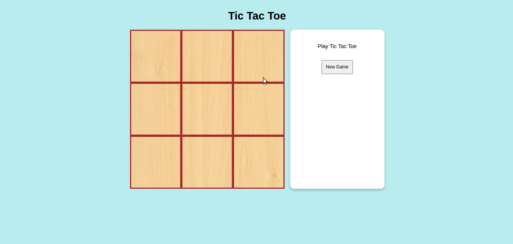

# Project: Tic Tac Toe

This is a Tic Tac Toe made with JavaScript, [guided by The Odin Project](https://www.theodinproject.com/lessons/javascript-tic-tac-toe). The primary focus of the learning outcomes here is JavaScript's modules, factory functions, and IIFEs.

## Gameplay

## Learning Outcomes

- Pretty much everything on what was mentioned above. I had the spaghettiest JS code ever back in the Calculator project, and I think this TTT project is a huge improvement in my JS skills for organizing the code and design decisions.
